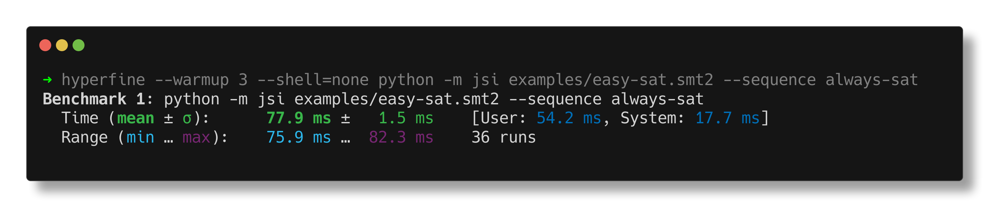

## Development

Pre-requisites: install [rye](https://rye.astral.sh/guide/installation/#installing-rye)

```sh
# clone the repo
git clone https://github.com/a16z/jsi
cd jsi

# install dependencies
rye sync

# runs the formatter, linter, type checker and tests
rye run all

# run the tool
rye run jsi --help

# run it without rye
python -m jsi --help

# run a single test
rye run pytest -v -k <test_name>
```

You can run install the development version of jsi using uv:

```sh
uv tool install --reinstall /path/to/jsi
```

### Redirect log output

```sh
# jsi will print its own output to stderr, so you can redirect it to a file
# (stdout is reserved for the best solver's output)
jsi 2> jsi.logs
```


### Profiling imports

```sh
# this will print import times to stderr
python -Ximporttime -m jsi ... 2> stderr.log

# this parses the log and displays a nice visual summary
uvx tuna stderr.log
```


### Benchmarking

I recommend using [hyperfine](https://github.com/sharkdp/hyperfine) to benchmark jsi.

```sh
# this only runs the "always-sat" virtual solver to evaluate jsi's overhead
hyperfine --warmup 3 --shell=none 'python -m jsi examples/easy-sat.smt2 --sequence always-sat'
```


