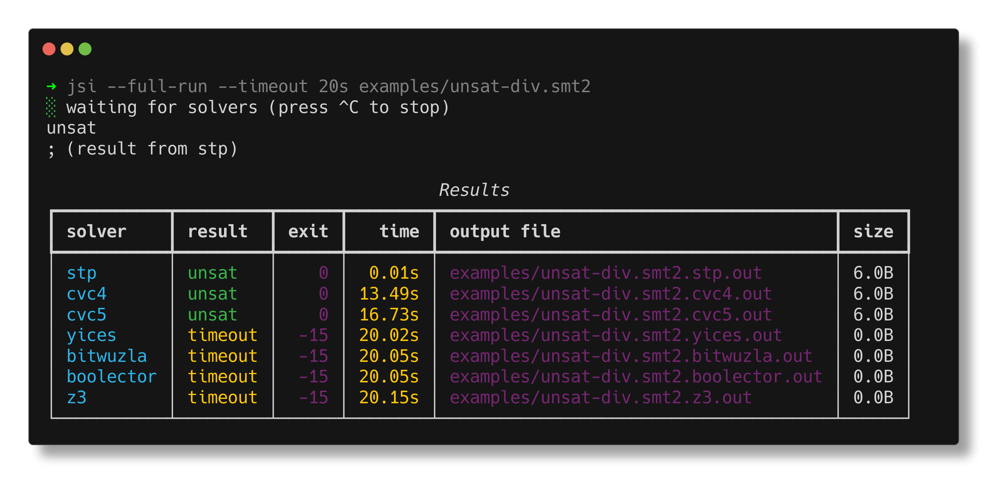
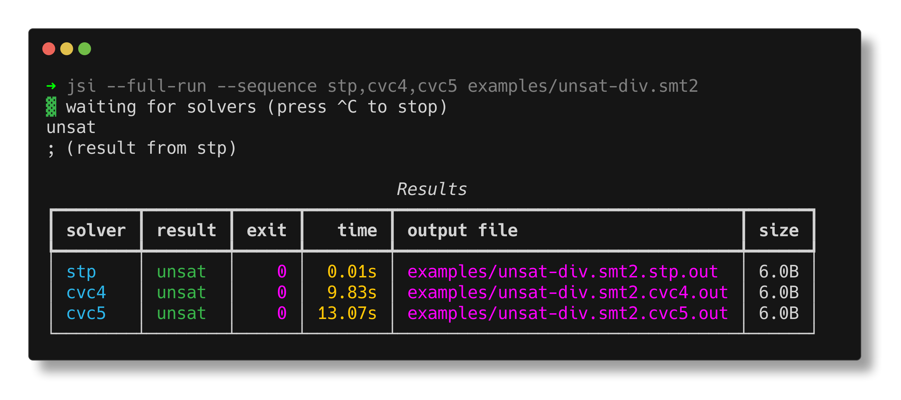

# jsi

just solve it - a command-line utility to run a portfolio of [SMT](https://en.wikipedia.org/wiki/Satisfiability_modulo_theories) solvers in parallel.




## Highlights

- 🏆 acts as a "virtual best solver" by running multiple solvers in parallel and printing the result of the fastest solver to stdout
- 🔍 discovers available solvers on on the PATH at runtime
- 🛣️ runs solvers in parallel and monitors their progress
- ⏰ can terminate solvers after a timeout
- ⏯️ can be interrupted by Ctrl-C and remaining solvers will be killed
- 🏎 runs with minimal startup time (<100ms), and also supports an experimental daemon mode with a rust client for extra low-latency (<10ms)
- 🔪 reaps orphaned solver processes
- 🖥️ supports macOS and Linux
- 🐍 supports Python 3.11+


## Getting Started

We recommend using [uv](https://docs.astral.sh/uv/) to install jsi.

```sh
# install jsi
uv tool install jsi

# run it
jsi --help
```


## Features

<details>
<summary>### 🧰 Configuration</summary>

This is how jsi finds and runs solvers:

- it first attempts to load custom solver definitions from `~/.jsi/solvers.json`
- if that file doesn't exist, it loads the default definitions from the installed package (see [src/jsi/config/solvers.json](src/jsi/config/solvers.json))

Based on these definitions, jsi knows what executables to look for, whether a given solver is enabled, how to enable model generation, etc.

Then:
- it looks up the solver cache in `~/.jsi/cache.json`
- if that file doesn't exist, it will scan the PATH and cache the results

It does this because scanning the PATH can be slow, but loading cached paths is 5x faster.

> [!TIP]
> `~/.jsi/cache.json` can always be safely deleted, jsi will generate it again next time it runs. If you make changes to `~/.jsi/solvers.json` (like adding a new solver), you should delete the cache file, otherwise jsi won't pick up the new solver.
</details>

### 🎨 Rich Output

jsi uses [rich](https://rich.readthedocs.io/en/stable/) to render nice colored output. However importing rich at startup adds about 30-40ms to jsi's startup time, so by default jsi only uses rich if it detects that its output is a tty.

> [!TIP]
> if you want to minimize jsi's startup time, you can force it to use basic output by redirecting its stderr to a file: `jsi ... 2> jsi.err`


### 📋 Run a specific sequence of solvers

Sometimes it can be useful to run only a subset of available solvers, for instance when you already know the top 2-3 solvers for a given problem.

jsi supports a `--sequence` option that allows you to specify a sequence of solvers to run as a comma-separated list of solver names (as defined in your `~/.jsi/solvers.json` file).




### 📊 CSV Output

In addition to the table output, jsi can also output results in CSV format, which is useful for further processing like generating graphs or importing into spreadsheets (especially in conjunction with the `--full-run` option).

```sh
$ jsi --full-run --sequence stp,cvc4,cvc5 --csv examples/unsat-div.smt2
stp returned unsat
cvc4 returned unsat
cvc5 returned unsat
unsat
; (result from stp)

                                   Results
┏━━━━━━━━┳━━━━━━━━┳━━━━━━┳━━━━━━━━┳━━━━━━━━━━━━━━━━━━━━━━━━━━━━━━━━━━┳━━━━━━┓
┃ solver ┃ result ┃ exit ┃   time ┃ output file                      ┃ size ┃
┡━━━━━━━━╇━━━━━━━━╇━━━━━━╇━━━━━━━━╇━━━━━━━━━━━━━━━━━━━━━━━━━━━━━━━━━━╇━━━━━━┩
│ stp    │ unsat  │    0 │  0.01s │ examples/unsat-div.smt2.stp.out  │ 6.0B │
│ cvc4   │ unsat  │    0 │  9.75s │ examples/unsat-div.smt2.cvc4.out │ 6.0B │
│ cvc5   │ unsat  │    0 │ 13.01s │ examples/unsat-div.smt2.cvc5.out │ 6.0B │
└────────┴────────┴──────┴────────┴──────────────────────────────────┴──────┘
writing results to: examples/unsat-div.smt2.csv

$ bat examples/unsat-div.smt2.csv

───────┬─────────────────────────────────────────────────────────────────────
       │ File: examples/unsat-div.smt2.csv
───────┼─────────────────────────────────────────────────────────────────────
   1   │ solver,result,exit,time,output file,size
   2   │ stp,unsat,0,0.01s,examples/unsat-div.smt2.stp.out,6
   3   │ cvc4,unsat,0,9.75s,examples/unsat-div.smt2.cvc4.out,6
   4   │ cvc5,unsat,0,13.01s,examples/unsat-div.smt2.cvc5.out,6
```


### 🧪 Experimental Daemon Mode

jsi can also run in daemon mode, where it will start a subprocess to handle requests. This mode is experimental and subject to change.

```sh
# start the daemon with
jsi --daemon

# or
python -m jsi.server

# tail server logs with
tail -f ~/.jsi/daemon/server.{err,out}
```

The daemon will listen for requests on a unix socket, and each request should be a single line containing the path to an smt2 file to solve.

You can then send requests to the daemon:

```sh
# directly with nc
$ echo -n $(pwd)/examples/easy-sat.smt2 | nc -U ~/.jsi/daemon/server.sock
sat
; (result from yices)

# with the included Python client
$ python -m jsi.client examples/easy-sat.smt2
sat
; (result from yices)
```

or for the lowest latency, use the included Rust client:

```sh
# build it
(cd jsi-client-rs && cargo build --release)

# install it
(cd jsi-client-rs && ln -s $(pwd)/target/release/jsif /usr/local/bin/jsif)

# use it
jsif examples/easy-sat.smt2
```

This benchmark shows why you might want to use the Rust client:

```sh
hyperfine --shell=none \
  "python -m jsi.client examples/easy-sat.smt2" \
  "jsif examples/easy-sat.smt2"

Benchmark 1: python -m jsi.client examples/easy-sat.smt2
  Time (mean ± σ):     290.9 ms ±   9.1 ms    [User: 75.7 ms, System: 18.9 ms]
  Range (min … max):   282.3 ms … 313.5 ms    10 runs

Benchmark 2: jsif examples/easy-sat.smt2
  Time (mean ± σ):     196.7 ms ±   4.3 ms    [User: 1.2 ms, System: 2.3 ms]
  Range (min … max):   190.9 ms … 207.2 ms    15 runs

Summary
  jsif examples/easy-sat.smt2 ran
    1.48 ± 0.06 times faster than python -m jsi.client examples/easy-sat.smt2
```

> [!WARNING]
> the daemon mode is experimental and subject to change


## Acknowledgements

The setup for this project is based on [postmodern-python](https://rdrn.me/postmodern-python/).


## Disclaimer

_This code is being provided as is. No guarantee, representation or warranty is being made, express or implied, as to the safety or correctness of the code. It has not been audited and as such there can be no assurance it will work as intended, and users may experience delays, failures, errors, omissions or loss of transmitted information. Nothing in this repo should be construed as investment advice or legal advice for any particular facts or circumstances and is not meant to replace competent counsel. It is strongly advised for you to contact a reputable attorney in your jurisdiction for any questions or concerns with respect thereto. a16z is not liable for any use of the foregoing, and users should proceed with caution and use at their own risk. See a16z.com/disclosures for more info._
